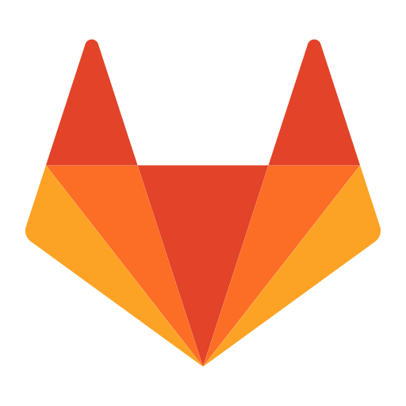

# Şammas Çölkesen 
### A curios software engineer from İstanbul.

#### Currenty working at <a href="https://www.atp.com.tr/">ATP</a>.

### Contact with me

       

### Tech Stack

 
  

 
   

  

    

## DevOps
 

    

   

   

## Tools

      

     

## Misc

      

### Trying to learn

    <a href="https://material-ui.com/">

    

  

### Planning to learn

   

 </a>    
